# Rock Paper Scissors

The rock paper scissor game goes back a long way. Everyone is familiar with it from every corner of the world. The goal of the webpage was to create this game using javaScript and make it an interactive and fun experience for everyone. Upon selection of one of the three available buttons, users will be able to interact with the computer by picking either the rock, paper, or scissors option. Despite its classic format, it can only be played by a single player while traditionally two players are required. As the game can be played alone, it is designed to appeal to a broad audience.
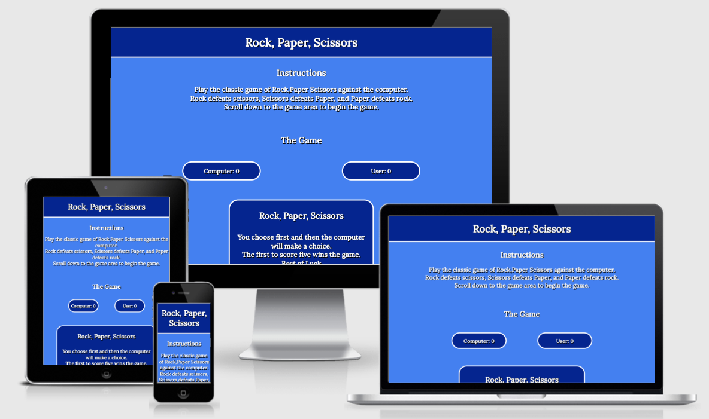

# Table of Contents
1. [Ux](#id-ux)
2. [Features](#id-features)
3. [Testing](#id-testing) 
4. [Validator Testing](#id-validator)
5. [Bugs](#id-bugs)
6. [Technologies used](#id-tech)
7. [Deployment](#id-deploy)
8. [Credits](#id-credits)
9. [Acknowledgements](#id-acknowledgements)


# Ux<div id='id-ux'>

## User Stories

* As a User

  * As a user, I want a website that is easy to navigate.
  * As a user, I want clear instructions on how to play the game.
  * As a user, I want to see an interactive game that will that will make a decision at random once I have made my choice.
  * As a user, I want to see a game that will be playable on all devices and performace and experience will not change.
  * As a user, I want there to be a score counter, that will keep track of the scores.
  * As a user, I want to be updated what choice the computer makes and who won that round.
  * As a user, I want there to be updated on the result once the game has finished.


  <p>&nbsp;</p>  

* As a returning user 

  * As a returning user, I want the website to be continually updated with new features to keep me coming back and playing the game.


# Features<div id='id-features'>
* ## The Header
When the user opens the webpage, the website logo is the first image that will catch their attention. It is large and stands out as it identifies the game to them immediately. As they will immediately know what it is that they are going to play once they open the webpage. When creating the logo I thought about the color scheme and decided on white for the text and I used rgb(68, 128, 240) for the background. I feel that this make the logo stand out.<p>&nbsp;</p>   
 

* ## Instructions
The instructions of the game are shown in a few bullet points below the header. This is useful in explaining how the game works if the user is unfamiliar with the game. It also indicates where the game is located within the website. For the body of the project I choose a background colour of rgb(68, 128, 240). I think the header and body colors go well together and complement each other.<p>&nbsp;</p>
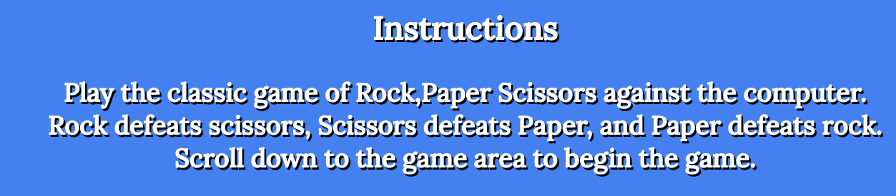

* ## Scores
This area is where the computer and users scores are displayed. To win the game it is the first to five and once the number reaches five the display will revert back to zero and the user can start a new game. This is useful to users as it keeps score of the game.<p>&nbsp;</p>
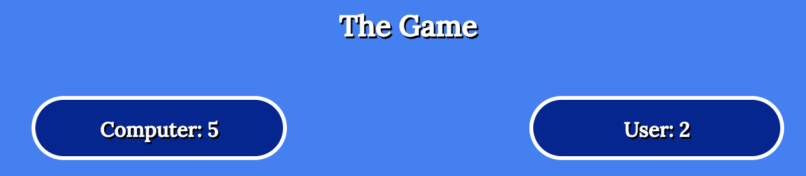

* ## Game area
The game area is the main part of the website as it is where the game takes place. There is a game box with a play game button beneath. This tells the user that they must first make a choice and the computer will then make their choice. It also explains that the first to reach a score of five wins the game. Once the user clicks the play game button both the game box and the play game button will dissappear and the game will begin.<p>&nbsp;</p>
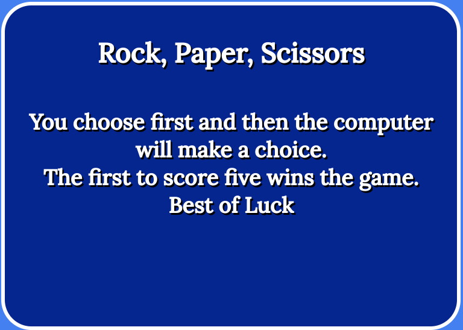
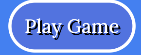


* ## Game 
The game is where the user gets to challenge the computer. THere are three hands rock paper and scissors. The user must choose one and then the computer will then make their choice which is completely at random. There are messages below to deliver the result to the user also while there score subsequently increase.<p>&nbsp;</p>
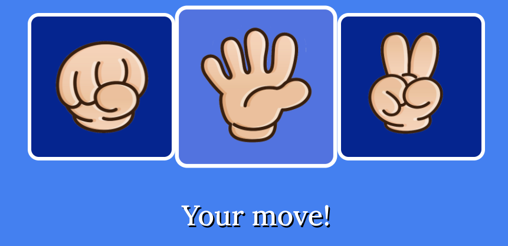 

* ## Result
Below the game each time the user and computer make their choice a message will be displayed with the result. THe message will tell the user what the computer pick and what the user picked. THe result will tell the user who won that round. After five rounds the result will change to a message either telling the user they have won or that they have  lost.<p>&nbsp;</p>
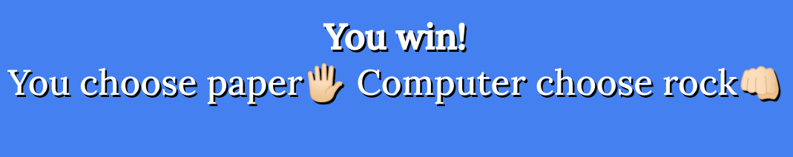 

* ## Win box
Users who defeat the computer are notified so by a box with text on it confirming that they have won. This is when the game is over after five rounds and the user can replay the game again. This is beneficial to the user, as they will be informed that the game has been won and the game will not continue after the win. The user can restart the game.<p>&nbsp;</p>
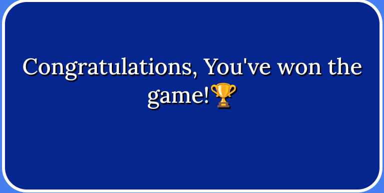

* ## Lose box
When the computer wins the users are notified by a box with text on it informing them that they have lost. This is when the game is over after five rounds and the user can replay the game again. This is beneficial to the user, as they will be informed that the game has been lost and the game will not continue. The user can restart the game.<p>&nbsp;</p>
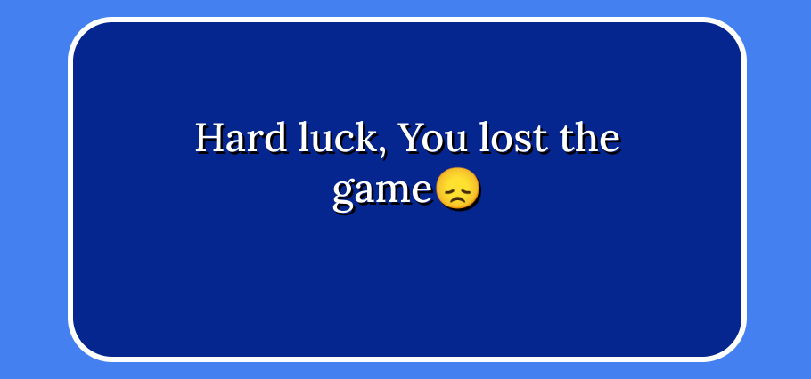

* ## Restart button
The user is presented with a message once they have won or lost. Below the text box, there is a button that allows the user to play again. The user's game is restarted after the images and score are reset.<p>&nbsp;</p>
 


* ### Features Left to Implement
 * I think I would definitely add some animations if I were to return to this website in the future. The game would be won or lost by an animation appearing on the screen, which would appear once the computer or user scored five points.
 * Presently, the user is notified by text of the website's computer selection. I would like to implement a feature that highlights the computers' choice with a colored background, while also communicating the result with the text below.


# Testing<div id='id-testing'>

* Search Engines
  * I tested my website on Google Chrome, Safari and Mozilla Firefox. The website appeared as I had intended it to  and performed well on those search engines. I did not encounter bugs or experience any issues.
* Amiresponsive
  * To test my website on all iphone devices I used [am i responsiveness](http://ami.responsivedesign.is/). I added a screenshot of how these look on the top of the Read.me.
  
  
### Tests were performed on the following devices to ensure their responsiveness and to ensure that all the features worked correctly and that there were no unresolved bugs.

* Mobile Phones/Tablet
   * Samsung Galaxy A50

   * Iphone 12
   
   * Apple Ipad.

* Desktop/Laptop
   * Apple Macbook

   * Apple Imac

   * ASUS Chromebook Flip C434


# Validator Testing<div id='id-validator'>

  * Lighthouse
    *  I tested he website on the Lighthouse testing in the chrome dev tools and the results are shown below.  

    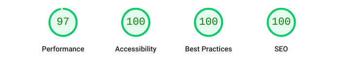


  * Html
    *  There were no errors found when I tested the webpage on the HTML validator.   
        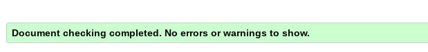
  

  * CSS
    *  There were no errors found when I tested the webpage on the CSS validator.  
            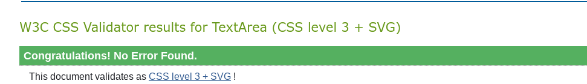


  * javaScript
    *  There were no errors found when I tested the webpage on jshint.   
            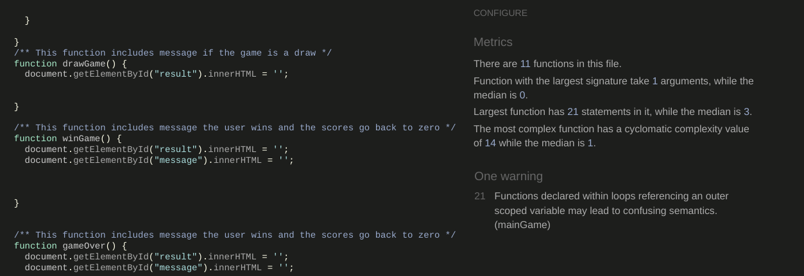

# Bugs<div id='id-bugs'>
   * There was only one problem I encountered while developing this website, and it was not an issue with the website itself. When I first tried to use jshint, I was getting a lot of errors which read "'const' is available in ES6 (use 'esversion: 6') or Mozilla JS extensions (use moz)." I had no idea what they were about. I Googled it and was unable to find an answer.
   * As a result, I went to Slack see if anyone else had this same issue. Someone was able to help. They explained that I would need to add /*jshint esversion: 6 */ at the top of the page, and then all these errors would be solved.

# Technologies Used<div id='id-tech'>
 * HTML5
 * CSS3 
 * javaScript
 * Gitpod 
 * GitHub 
 * Google Fonts
 * shutterstock
 * Chrome dev tools

# Deployment<div id='id-deploy'>


These are the steps used to deploy the website. The site was deployed using GitHub.
* Create the repository for the website you wish to publish.
* The next step is to push code.
* Then go to the settings.
* Scroll down to Github pages and click on the link.
* Then at the source there is a drop down icon click on this and select main branch.
* The page will refresh with a link to the website. Once the link is selected then website is deployed.

The live link to this website can be found here - https://squirkey89.github.io/Rock-Paper-Scissor-portfolio-project/
 

# Credits<div id='id-credits'>
  * I used Am I Responsive web site for checking responsiveness on all Apple devices screen sizes [am i responsiveness](http://ami.responsivedesign.is/)
  * When coding the project I referenced the [love maths project](hhttps://github.com/Code-Institute-Solutions/love-maths-2.0-sourcecode)
  * Code was referenced from Dani Krossing's [YouTube channel](https://www.youtube.com/watch?v=kEf1xSwX5D8) when creating this website's Favicon.
  Here is the code:```link rel="shortcut icon" href="assets/images/android-chrome-192x192.png"```


**Media**
  * All the images used in the website were taken from [shutterstock](.https://www.shutterstock.com/).
  * The icon used for the websites favicon was created and downloaded from [Favicon Generator](https://favicon.io/).
  * The emojis that I used in the game were taken from [getemoji](https://getemoji.com/).

# Acknowledgments<div id='id-acknowledgements'>
   * My mentor for the useful feedback direction and guidance.
   * The online tutors and the slack community for help and and advice.
   * Code Institite course material.


