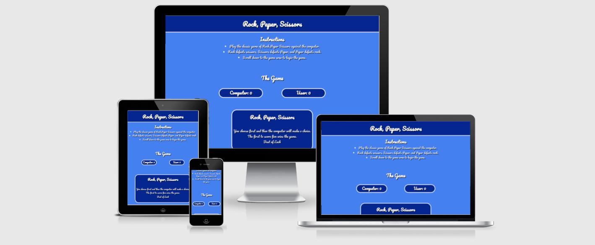
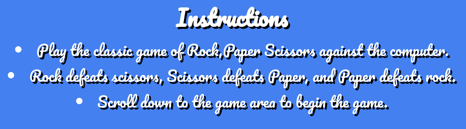
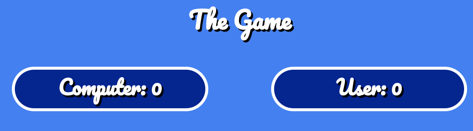
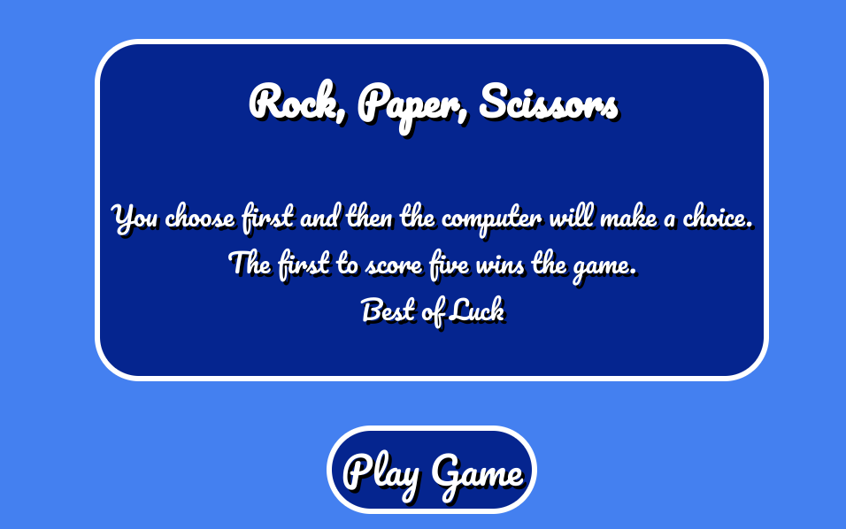
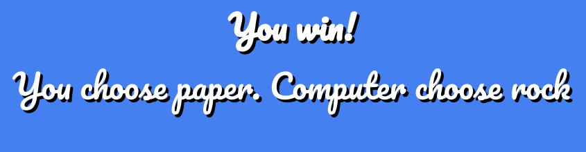

# Rock Paper Scissors

The rock paper scissor game goes back a long way. Everyone is familiar with it from every corner of the world. The goal of the webpage was to create this game using javaScript and make it an interactive and fun experience for everyone. Upon selection of one of the three available buttons, users will be able to interact with the computer by picking either the rock, paper, or scissors option. As this is an online game, it can be enjoyed alone and by anyone.

# Table of Contents
1. [Features](#id-features)
2. [Testing](#id-testing) 

## Features

* ### The Header
When the user opens the webpage, the website logo is the first image that will catch their attention. It is large and stands out as it identifies the game to them immediately. As they will immediately know what it is that they are going to play once they open the webpage. When creating the logo I thought about the color scheme and decided on white for the text and I used rgb(68, 128, 240) for the background. I feel that this make the logo stand out.

* ### Instructions
The instructions of the game are shown in a few bullet points below the header. This is useful in explaining how the game works if the user is unfamiliar with the game. It also indicates where the game is located within the website. For the body of the project I choose a background colour of rgb(68, 128, 240). I think the header and body colors go well together and complement each other.

* ### Scores
This area is where the computer and users scores are displayed. To win the game it is the first to five and once the number reaches five the display will revert back to zero and the user can start a new game. This is useful to users as it keeps score of the game.

* ### Game area
The game area is the main part of the website as it is where the game takes place. There is a game box with a play game button beneath. This tells the user that they must first make a choice and the computer will then make their choice. It also explains that the first to reach a score of five wins the game. Once the user clicks the play game button both the game box and the play game button will dissappear and the game will begin.
  

* ### Game 
The game is where the user gets to challenge the computer. THere are three hands rock paper and scissors. The user must choose one and then the computer will then make their choice which is completely at random. There are messages below to deliver the result to the user also while there score subsequently increase.
  

* ### Game
Below the game each time the user and computer make their choice a message will be displayed with the result. THe message will tell the user what the computer pick and what the user picked. THe result will tell the user who won that round. After five rounds the result will change to a message either telling the user they have won or that they have  lost.

 

## Testing

* Search Engines
  * I tested my website on Google Chrome, Safari and Mozilla Firefox. The website appeared as I had intended it to  and performed well on those search engines. I did not encounter bugs or experience any issues.
* Amiresponsive
  * To test my website on all iphone devices I used [am i responsiveness](http://ami.responsivedesign.is/). I added a screenshot of how these look on the top of the Read.me.
  
  
### Tests were performed on the following devices to ensure their responsiveness and to ensure that all the features worked correctly and that there were no unresolved bugs.

* Mobile Phones/Tablet
   * Samsung Galaxy A50

   * Iphone 12
   
   * Apple Ipad.

* Desktop/Laptop
   * Apple Macbook

   * Apple Imac

   * ASUS Chromebook Flip C434

